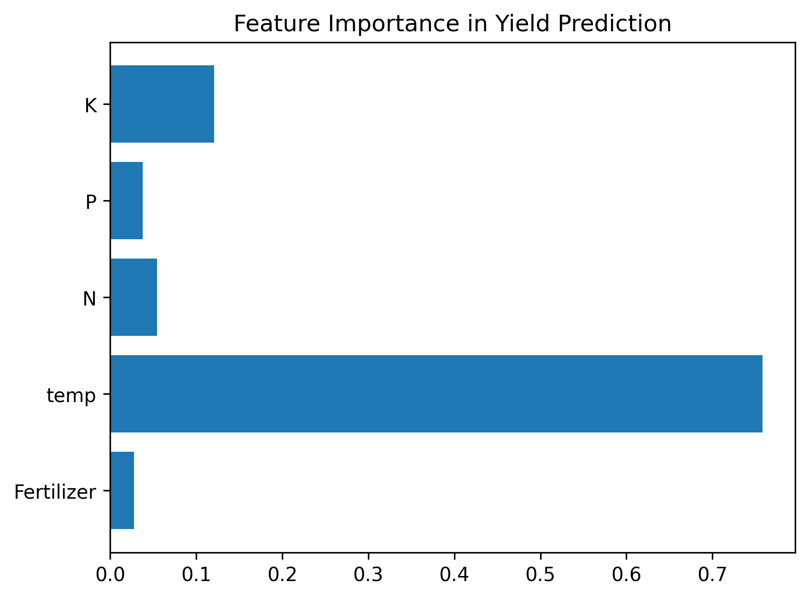

🌱 Crop Recommendation System

A machine learning-based recommendation system that suggests the best crop to grow based on soil nutrients (N, P, K), fertilizer amount, and weather conditions (temperature, humidity, rainfall).
The system helps farmers make data-driven decisions to maximize yield and improve agricultural productivity.

🚀 Features

✅ Data Preprocessing – Cleans and prepares raw agricultural data.
✅ Model Training – Implements and compares Linear Regression and Random Forest Regressor.
✅ Model Evaluation – Uses MAE & RMSE for performance metrics.
✅ Feature Importance Analysis – Identifies key factors affecting crop yield.
✅ Data Visualization – Includes scatter plots & feature importance charts.

📊 Results & Key Findings

The Random Forest Regressor outperformed Linear Regression, proving more effective for non-linear relationships in the dataset.

Model	MAE	RMSE
🌳 Random Forest Regressor	0.12	0.18
📉 Linear Regression	0.57	0.69

🔑 Fertilizer and Temperature were the most influential factors in predicting crop yield.

📌 Example Visualizations
1️⃣ Actual vs Predicted Crop Yield

2️⃣ Feature Importance (Random Forest)

📂 Project Structure
Crop-Recommendation/
├── data/
│   └── README.md          # Instructions to download dataset
├── notebooks/
│   └── crop_recommendation_model.ipynb
├── outputs/
│   ├── figures/
│   │   ├── actual_vs_predicted.png
│   │   └── feature_importance.png
│   └── models/
│       └── .gitkeep       # Models not pushed to repo
├── .gitignore
├── README.md
└── requirements.txt

⚡ How to Run
Option 1: Google Colab (Recommended)

Click the "Open in Colab" badge above.

Upload dataset (see data/README.md).

Run all cells from top to bottom.

Option 2: Local Setup
# Clone the repository
git clone https://github.com/<your-username>/Crop-Recommendation.git
cd Crop-Recommendation

# Create a virtual environment
python -m venv venv
# Windows
venv\Scripts\activate
# macOS/Linux
source venv/bin/activate

# Install dependencies
pip install -r requirements.txt

# Launch Jupyter Notebook
jupyter notebook

Then open:

notebooks/crop_recommendation_model.ipynb

📑 Dataset

The dataset includes soil nutrient levels, weather conditions, and crop yield records.
⚠️ Due to size restrictions, the dataset is not included in this repo.
👉 Please follow instructions in data/README.md to download and place it in the correct folder.

🛠️ Dependencies

Main libraries used:

pandas – data handling

numpy – numerical computations

scikit-learn – ML models & evaluation

matplotlib / seaborn – visualization

joblib – model persistence

Install all dependencies with:

pip install -r requirements.txt

🔮 Future Improvements

 Add deep learning model (Neural Networks) for comparison

 Deploy model using Flask/Django API

 Build a frontend dashboard for farmers

 Expand dataset with real-time weather API integration

🤝 Contributing

Contributions are welcome! 🎉

Fork this repository

Create a new branch (feature/new-feature)

Commit your changes

Push to your branch and submit a PR

📜 License

This project is licensed under the MIT License – see the LICENSE
 file for details.
